# 해커스 앤 디자이너스 - 걸어다니는 신호들 / 와이파이-진 워크숍.

## 와이파이-진(zine) 이란?

### 한 줄 설명

- 스마트폰이 핫스팟 로그인을 시도할때, 웹진 형식의 자주독립출판물을 서비스하도록 설계된 무선통신 및 웹서비스 장치

[{:width="500px"}](./assets/hotspot-zine-ssid.jpg)
[{:width="500px"}](./assets/hotspot-zine-login.jpg)

- [더보기](http://pilote.byus.net/wpdiana/?page_id=1064)

### 선행 프로젝트

- [CaptiveIntraweb by AReResearch (Andy Reischle) @ 2015](https://github.com/reischle/CaptiveIntraweb)

  [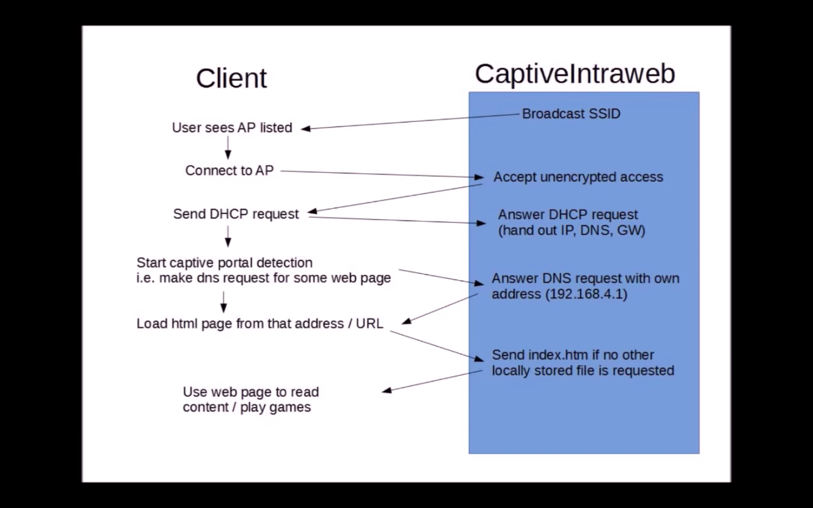{:width="500px"}](./assets/areresearch/img4.png)

### 구성요소

- 유형 요소 (tangible components)
  - Espressif사의 ESP32 모듈
  - 전원장치 (배터리 또는 DC 아답타)
  - (선택적) 통 또는 외형
  - (선택적) 자석

  [{:width="500px"}](./assets/areresearch/img1.png)

  [{:width="500px"}](./assets/areresearch/img2.png)

  [{:width="500px"}](./assets/areresearch/img5.png)

  [{:width="500px"}](./assets/areresearch/img6.png)

  [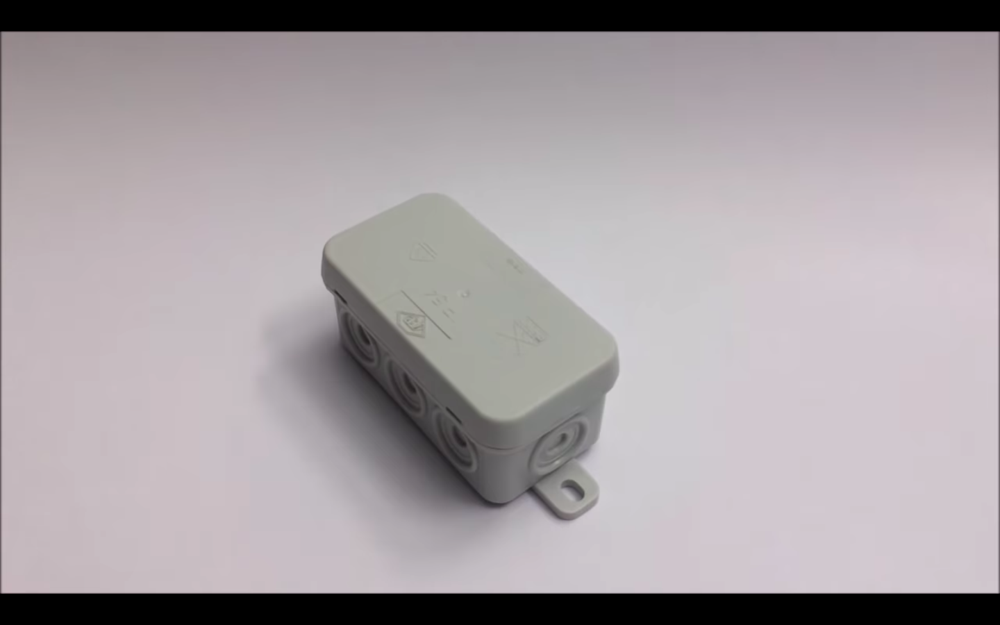{:width="500px"}](./assets/areresearch/img7.png)

  (위 이미지들은 Andy Reischle (AReResearch) 님이 게시한 것들입니다.)

- 무형 요소 (intangible components)
  - [ESP-IDF 개발 환경](https://github.com/espressif/esp-idf/tree/master/components)
  - [ESP32 아두이노 호환성 패키지](https://github.com/espressif/arduino-esp32)
  - [SPIFFS 파일 시스템](https://github.com/espressif/arduino-esp32/tree/master/libraries/SPIFFS)
  - [ESP 웹서버 라이브러리](https://github.com/me-no-dev/ESPAsyncWebServer)
  - [도메인 네임서버(captive portal)](https://github.com/espressif/arduino-esp32/tree/master/libraries/DNSServer)
  - 웹페이지 (웹-진)

  [{:width="500px"}](./assets/Wi-Fi-zine-stacks.png)

  - [더 많은 정보](http://esp32.net/)
  - [Wi-Fi 스택이 오픈소스가 아닌 문제](https://github.com/espressif/esp32-wifi-lib/issues/2)

### 알아두어야 할 와이파이-진 시스템의 한계

- 저장용량 2MB 이하
- 일반적인 웹서버에 비해 다소 느린 속도
- 일반적인 웹서버에 비해 다소 불안정한 작동 (때때로, 시스템 재시작이 필요할 수 있음)

## 와이파이-진 만들기

### 재료 및 준비물

- 컴퓨터
- ESP32 모듈이 탑재된 개발보드
- 통신용 마이크로 USB 케이블 (안드로이드 데이타 케이블)
- 배터리, 배터리팩 또는 DC 아답타
- 웹페이지 (html/css/js + 미디어 파일)
- (선택적으로) 센서 또는 작동장치 (스피커 등)

### 와이파이-진 보드 준비하기

- [Arduino 다운로드](https://www.arduino.cc/en/Main/Software)

- Arduino 설치하기

  - [Windows](https://www.arduino.cc/en/Guide/Windows)

  - [Mac OSX](https://www.arduino.cc/en/Guide/MacOSX)

    [{:width="300px"}](./assets/arduino-confirm.png)

    'Open' 을 클릭.

  - [Linux](https://www.arduino.cc/en/Guide/Linux)

- Arduino IDE 실행 화면

  [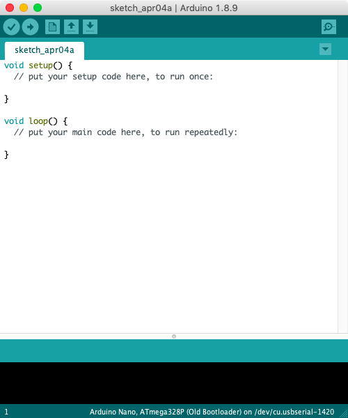{:width="300px"}](./assets/arduino-screen.png)

- Arduino IDE 설정

  - 컴파일 및 업로드 과정 표시 모드를 '상세한 표기'로 변경

    [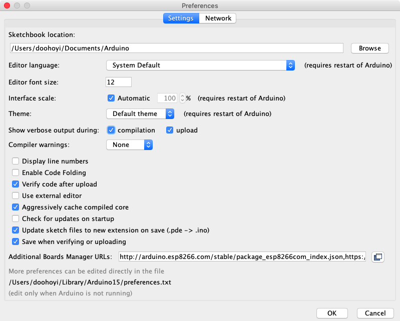{:width="300px"}](./assets/arduino-verbose.png)

    'Show verbose output during:' 항목에서 compilation과 upload에 체크

- [Arduino IDE에 esp32 보드를 추가하기](https://github.com/espressif/arduino-esp32/blob/master/docs/arduino-ide/boards_manager.md)

  - 'Additional Boards Manager URLs' 에 다음 내용을 복사하여 붙여넣고 'Ok'.

    ```
    https://dl.espressif.com/dl/package_esp32_index.json
    ```

    [{:width="300px"}](./assets/arduino-board-url.png)

  - 보드 매니져 실행

    [{:width="300px"}](./assets/arduino-board-manager.png)

  - 보드 매니져 팝업창의 모습

    [{:width="300px"}](./assets/arduino-board-manager-popup.png)

  - 검색창에 'esp32'라고 입력 후, 'Install' 클릭

    [{:width="300px"}](./assets/arduino-board-manager-esp32.png)

- Arduino IDE에 와이파이-진 코드와 필요한 라이브러리들 추가하기

  - [와이파이-진](https://github.com/applecargo/WifiZineThrowie/) 다운로드 및 설치

    'Clone or download' -> 'Download ZIP' 클릭

    [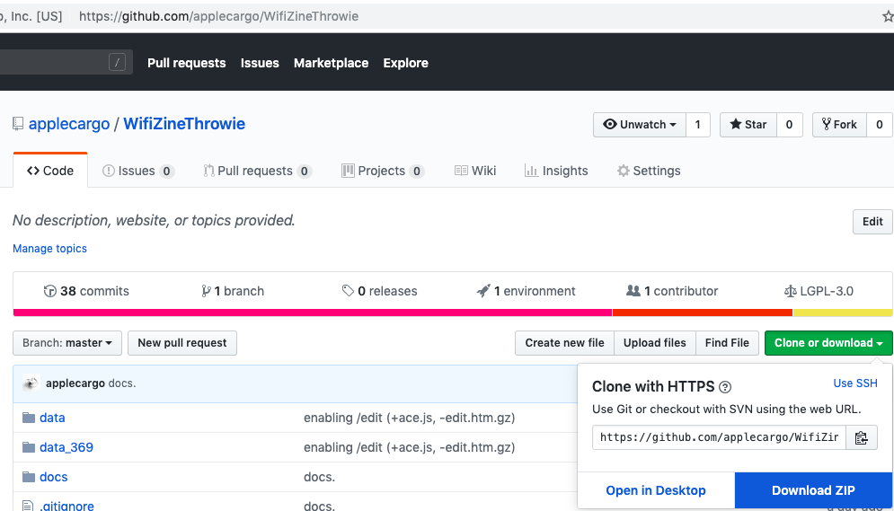{:width="300px"}](./assets/arduino-00010.png)

    압축 해제 후, 폴더 이름 변경

    [{:width="300px"}](./assets/arduino-00011.png)
    [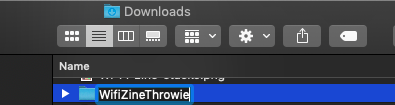{:width="300px"}](./assets/arduino-00012.png)

    ~/Documents/Arduino에 해당 폴더 복사

    [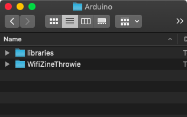{:width="300px"}](./assets/arduino-00013.png)

  - [ESPAsyncWebServer](https://github.com/me-no-dev/ESPAsyncWebServer)와 [AsyncTCP](https://github.com/me-no-dev/AsyncTCP) 라이브러리 다운로드 및 설치

    'Clone or download' -> 'Download ZIP' 클릭

    [{:width="300px"}](./assets/arduino-00001.png)

    압축 해제 후, 폴더 이름 변경

    [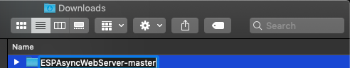{:width="300px"}](./assets/arduino-00003.png)
    [{:width="300px"}](./assets/arduino-00004.png)

    'Clone or download' -> 'Download ZIP' 클릭

    [{:width="300px"}](./assets/arduino-00006.png)

    압축 해제 후, 폴더 이름 변경

    [{:width="300px"}](./assets/arduino-00007.png)
    [{:width="300px"}](./assets/arduino-00008.png)

    ~/Documents/Arduino/libraries에 해당 폴더 (2개) 복사

    [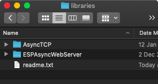{:width="300px"}](./assets/arduino-00009.png)

  - 컴파일 확인

    - Arduino IDE를 재시작

    - 'WifiZineThrowie' 스케치를 연다

      [{:width="300px"}](./assets/arduino-wifizine.png)

    - ESP32 Dev Module 보드를 선택한다

      [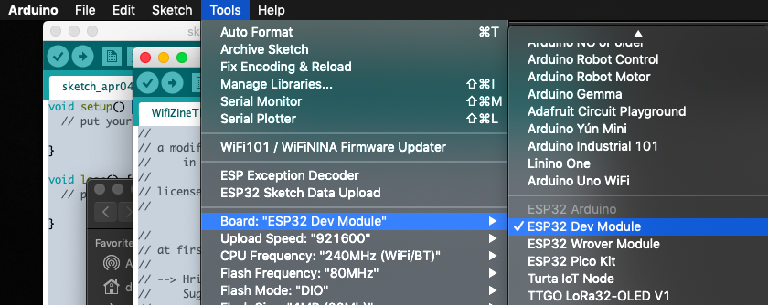{:width="300px"}](./assets/arduino-wifizine-select-board.png)

    - ESP32 Dev Module 보드 설정을 조정한다

      [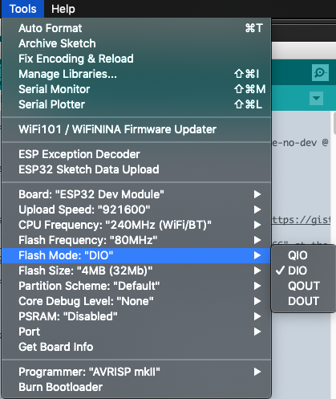{:width="300px"}](./assets/arduino-wifizine-config-board.png)

      - Upload Speed : 921600
      - CPU Frequency : 240MHz
      - Flash Frequency : 80MHz
      - Flash Mode : DIO
      - Flash Size : 4MB (32Mb)
      - Partition Scheme : Default
      - Core Debug Level : None
      - PSRAM : Disabled

    - 컴파일 버튼(빨간 화살표)을 클릭한다

      [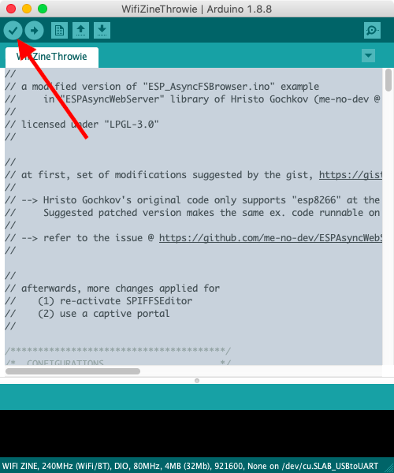{:width="300px"}](./assets/arduino-wifizine-popup.png)

    - 컴파일 과정이 정상적으로 끝나면, 성공

      [{:width="300px"}](./assets/arduino-wifizine-compile-done.png)

    - 컴파일 과정이 비-정상적으로 끝나면, 실패

      [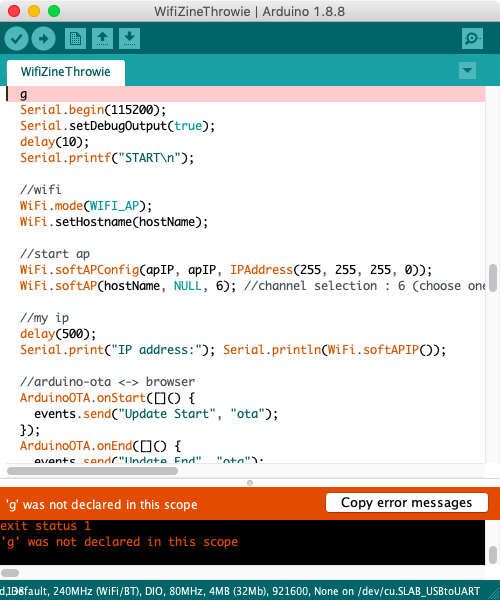{:width="300px"}](./assets/arduino-wifizine-compile-failed.png)

- ESP32 모듈과 통신하기 위한 USB 장치 드라이버 설치하기 (칩 이름 : SiliconLabs CP2012)

  - [USB 통신 칩 드라이버 다운로드](https://www.silabs.com/products/development-tools/software/usb-to-uart-bridge-vcp-drivers)

    - [Windows 10](https://www.silabs.com/documents/public/software/CP210x_Universal_Windows_Driver.zip)
    - [Windows 7/8/8.1](https://www.silabs.com/documents/public/software/CP210x_Windows_Drivers.zip)

      - [설치 과정](https://www.pololu.com/docs/0J7/all)

    - [Mac OSX](https://www.silabs.com/documents/public/software/Mac_OSX_VCP_Driver.zip)

      - [GateKeeper와의 전쟁](https://support.apple.com/en-us/HT202491)

      - Yosemite (10.10.x)

        - [Legacy 드라이버를 설치해야 함](https://www.silabs.com/community/interface/forum.topic.html/latest_vcp_driverfo-96RK)

        [{:width="300px"}](./assets/yosemite-cp2102.png)
        [{:width="300px"}](./assets/yosemite-cp2102-legacy.png)

      - El capitan (10.11.x)

        - [GateKeeper 비활성화 방법](https://medium.com/@krukmat/macos-el-capitan-enabling-usb-for-cp2102-usb-to-ttl-3b63449e02e9)
        - [csrutil enable --without kext](https://forums.developer.apple.com/thread/17452)

      - Sierra (10.12.x)

        - [GateKeeper 비활성화 방법](https://www.tekrevue.com/tip/gatekeeper-macos-sierra/)
        - sudo spctl --master-disable

      - High Sierra (10.13.x)

        - [GateKeeper 비활성화 방법](https://stackoverflow.com/questions/47109036/cp2102-device-is-not-listed-in-dev-on-macos-10-13)
        - [GateKeeper 비활성화 방법](https://pikeralpha.wordpress.com/2017/08/29/user-approved-kernel-extension-loading/)
        - [GateKeeper 비활성화 방법](https://www.silabs.com/community/interface/knowledge-base.entry.html/2018/03/30/usb_to_uart_bridgev-Dnef)
        - spctl kext-consent disable

      - Mojave (10.14.x)

        - [GateKeeper 비활성화 방법](http://osxdaily.com/2016/09/27/allow-apps-from-anywhere-macos-gatekeeper/)
        - sudo spctl --master-disable

    - Linux 3.x.x & 4.x.x

      - 드라이버 설치 불필요 (커널에 포함되어 있음)
      - [udev rules 업데이트 필요](https://docs.platformio.org/en/latest/faq.html#platformio-udev-rules)
      - [99-platformio-udev.rules](https://raw.githubusercontent.com/platformio/platformio-core/develop/scripts/99-platformio-udev.rules)

    - [Linux 2.6.x](https://www.silabs.com/documents/login/software/Linux_2.6.x_VCP_Driver_Source.zip)

      - 정보 없음

- USB 드라이버 작동 여부 확인하기

  - 드라이버를 지금 막 설치했다면, 컴퓨터를 재시작한다

  - 재시작한 후에 GateKeeper가 드라이버 로딩을 방해하지는 않았는지 확인한다.

    - System Preferences -> Security & Privacy -> General

      [{:width="300px"}](./assets/gatekeeper-check.png)
      [{:width="300px"}](./assets/gatekeeper-check-popup.png)

      빨간색으로 표시된 상자안에 에러문구가 있다면, GateKeeper가 드라이버 작동을 방해한 경우이다.

      [{:width="300px"}](./assets/security_and_privacy_kextload_approval.png)

      위와 유사한 상태가 되어있을경우, 'Allow'를 클릭하고 관리자 암호를 넣어 승인해준 후, 컴퓨터를 재시작한다.

  - Arduino IDE를 시작한 후에, ESP32 모듈과 통신 가능한지 확인

    [{:width="300px"}](./assets/arduino-esp32-comm.png)

    통신이 가능한 경우, 위와 같이 /dev/cu.SLAB_USBtoUART를 선택할 수가 있다.

    [{:width="300px"}](./assets/arduino-esp32-comm-failed.png)

    통신이 불가능한 경우, 위와 같이 /dev/cu.SLAB_USBtoUART가 존재하지 않는다.

- 와이파이-진 네트워크의 이름, 즉 SSID를 정하고 코드를 수정한다.

  [{:width="300px"}](./assets/arduino-wifizine-ssid-change.png)

  - 글자 수나 띄어쓰기 등에 의해서 안될 수도 있으므로, 처음에는 공백문자가 포함되지 않은 간단한 영문으로 테스트해본다.
  - 한글을 사용해도 된다.

- 보드에 업로드 한다

  - 업로드 버튼(빨간 화살표)을 클릭하고, 'Connecting...' 이란 문구가 나타났을때, [ESP 보드의 'BOOT'라는 버튼을 1초간 눌렀다가 뗀다](https://randomnerdtutorials.com/solved-failed-to-connect-to-esp32-timed-out-waiting-for-packet-header/).

    [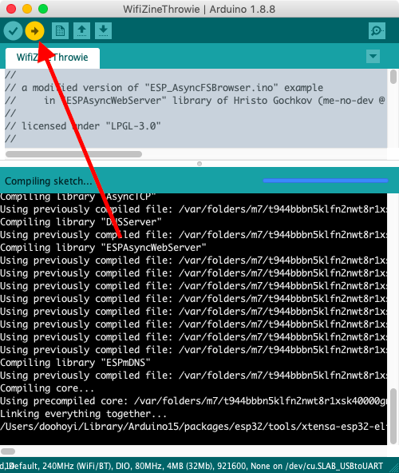{:width="300px"}](./assets/arduino-wifizine-upload.png)

    업로드 성공한 화면

    [{:width="300px"}](./assets/arduino-wifizine-upload-done.png)

    업로드 실패한 화면

    [{:width="300px"}](./assets/arduino-wifizine-upload-failed.png)

- [다양한 문제 요인들](https://randomnerdtutorials.com/esp32-troubleshooting-guide/)

### 와이파이-진 보드 업로드 용량 늘리기 (선택적인 과정)

- 제공된 ESP32 모듈의 플래쉬 메모리 용량은 4MB이지만, 전부 다 와이파이-진 컨텐츠를 위해서 사용할 수는 없다. 그 이유는 와이파이-진을 구동하는 코드와 칩 자체의 작동을 위한 코드, 그리고 파일 시스템의 구조 (폴더 구조 및 파일의 구분 등)를 표현하기 위해 사용되는 데이터, 즉 SPIFFS의 구현에 의한 오버헤드와 같은 것들이 4MB 중 일부분을 사용하지 않을 수 없기 때문이다.

- ESP32 모듈의 플래쉬 메모리는 작동하는 데이터(즉, 코드), 저장해 두어야 하는 데이터(즉, 메모리), 구조를 기록하는 데이터(즉, 파일 시스템) 등이 파티션을 통해 4MB를 나누어 사용하도록 되어있다.

- 위의 과정 중에서, ESP32 보드를 설정할때,

  [{:width="300px"}](./assets/arduino-wifizine-config-board.png)

  ```
  Partition Scheme : Default
  ```

  를 선택했었는데, 기본 파티션 구성의 경우 와이파이-진을 위해서 반드시 필요하지 않은 요소들을 포함하고 있으며, 기본 파티션 구성에서 와이파이-진 컨텐츠에 사용할 수 있는 메모리 용량은 1MB 정도밖에는 되지 않는다.

- 따라서, Partition Scheme을 보다 효율적으로 재구성하면, 와이파이-진 컨텐츠를 조금 더 많이 업로드 할 수 있게 할 수도 있다. 이렇게 하면, 약 1.9MB 정도의 용량을 사용할 수 있게 된다.

- 본 과정을 마치게 되면, 다음과 같이

  [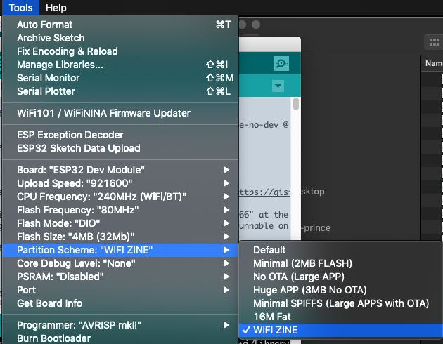{:width="300px"}](./assets/arduino-wifizine-custom-partition.png)

  ```
  Partition Scheme : WIFI ZINE
  ```

  을 선택할 수 있게 된다.

- 작업 과정

  

#### Uploading the zine content

- Installing additional tools for extending arduino functionality to support ESP data uploading (for the website data)
- Let’s try again the most simplest one: ‘Hello, world!’ example page

#### Working with your zine contents

- Template #1 : Text-oriented single page: ‘Hello, world!’
- Template #2 : Image-oriented single page: ‘Imaginary, world.’
- Template #3 : Sound-oriented single page: ‘Sound world!’
- Template #4 : Multiple-pages: ‘Looooong story!’
- Template #5 : Paper.js
- Template #6 : P5.js
- Template #7 : <http://molleindustria.github.io/p5.play/>
- Template #8 : Tone.js
- Template #9 (advanced) : WebSocket - socket.io + server-side programming @ arduino

#### Working with the shape and materialization

- Adding sensors : example (buttons)
- Adding actuators : example (motor)

#### Working with the location

- Magnets and installing at public space

### Contribution to the project

- Sharing your zine content & construction + your concept/context
- Approvements on the wifi-zine code: send PR @ github
  - And plz be patient, i have never used PR system.. Need to learn :)
- Or simply e-mail your idea and stuff : <mailto:pilotedeguerre@gmail.com>

### Thank you!
