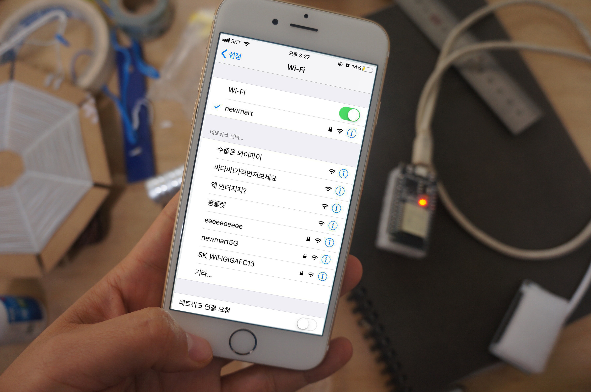

# 해커스 앤 디자이너스 - 걸어다니는 신호들 / 와이파이-진 워크숍.

## 와이파이-진(zine) 이란?

- 스마트폰이 핫스팟 로그인을 시도할때, 웹진 형식의 자주독립출판물을 서비스하도록 설계된 무선통신 및 웹서비스 장치

[{:width="500px"}](./assets/hotspot-zine-ssid.jpg)
[{:width="500px"}](./assets/hotspot-zine-login.jpg)

- 구성품
  - Espressif사의 ESP32 모듈
  - (유)무선 전원장치
  - () 자석
  - (optional) A case / a hull : you shape/materialize it to give it more context/happening.

  - 도메인 네임서버(captive portal)
  - 웹페이지 (웹-진)

- [more info](http://pilote.byus.net/wpdiana/?page_id=1064)

## 작업 가이드

### How to make one?

#### What is needed.

- A computer
- A ESP32 breakout board
- microUSB cable (so called, android data cable)
- A battery or powerbank
- A webpage (html/css/js + media files)
- (optional) Sensory peripherals or actuators (incl. speakers etc) : to give it more context/happening.
- (optional) A concept / a idea

#### Limitations

- Storage 2MB (or less)
- A bit slower than normal web servers
- Maybe a bit unstable from time to time : you can re-start the module whenever needed.

#### How to upload your code to the device

- Installing USB driver which enables us to communicate to the chip (i.e. the module: ESP32)
  - For Windows users
    - Windows 7
    - Windows 8
    - Windows 10
  - For Mac OSX users
    - Yosemite (10.10)
    - El capitan (10.11)
    - Sierra (10.12)
    - High Sierra (10.13)
    - Mojave (10.14)
  - For Linux
    - Debian derived
    - Archlinux derived

  - Testing USB communication
    - Enabling verbose/detailed output of the procedure that arduino takes for compilation and uploading steps
    - Try compile & upload and see if it works with the simplest example: Blink example
    - How to listen to the device with Serial comm. Example

  - Preparing hotspot-zine code and installing additional components that is needed by the code (libraries)
    - How to use arduino’s Library Manager to install a new library
    - What we need to install
      - ESP32AsyncWebServer
      - AsyncTCP
      - …
    - Where is the code?
      - USB drive
      - Or github, using git.
  - Choose your SSID and modify the default one
  - Try compile & upload and see what happens.

#### Uploading the zine content

- Installing additional tools for extending arduino functionality to support ESP data uploading (for the website data)
- Let’s try again the most simplest one: ‘Hello, world!’ example page

#### Working with your zine contents

- Template #1 : Text-oriented single page: ‘Hello, world!’
- Template #2 : Image-oriented single page: ‘Imaginary, world.’
- Template #3 : Sound-oriented single page: ‘Sound world!’
- Template #4 : Multiple-pages: ‘Looooong story!’
- Template #5 : Paper.js
- Template #6 : P5.js
- Template #7 : <http://molleindustria.github.io/p5.play/>
- Template #8 : Tone.js
- Template #9 (advanced) : WebSocket - socket.io + server-side programming @ arduino

#### Working with the shape and materialization

- Adding sensors : example (buttons)
- Adding actuators : example (motor)

#### Working with the location

- Magnets and installing at public space

### Contribution to the project

- Sharing your zine content & construction + your concept/context
- Approvements on the wifi-zine code: send PR @ github
  - And plz be patient, i have never used PR system.. Need to learn :)
- Or simply e-mail your idea and stuff : <mailto:pilotedeguerre@gmail.com>

### Thank you!

### backup text

- 등장 배경 및 기술 환경
  - 와이파이 무선통신 기기의 등장
  - 해당 기기의 웹서비스 기능 안정화
  - 모바일 기기의 웹브라우져 탑재 및 핫스팟 로그인 프로토콜 적용 보편화
- 의미 및 관심
  - 인터넷(The Internet)은 인터넷 서비스 공급자(ISP)들에 의존적인 '자본화된 네트워크'이다. 지역화/개인화된 전파 네트워크
  - 방송의 송신자와 수신자가 물리적으로 상호교감이 가능한 거리에 존재함으로서 유발되는 감정적/심정적/대화적 연대 가능성 탐구

  - 웹진 송출의 상황적 맥락(형태 및 설치 장소 등)
