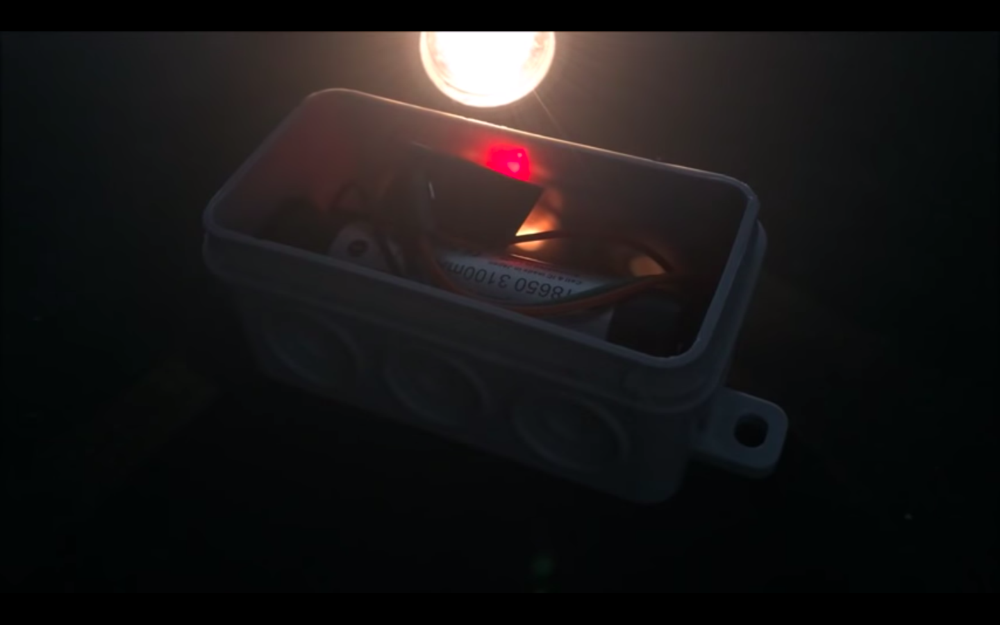
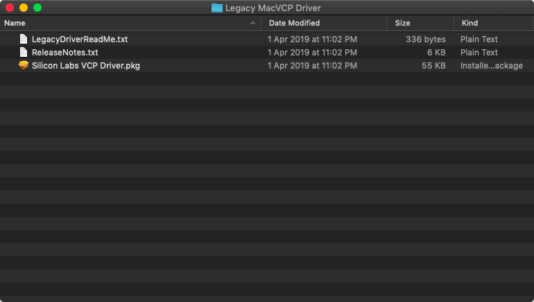

# 해커스 앤 디자이너스 - 걸어다니는 신호들 / 와이파이-진 워크숍.

## 와이파이-진(zine) 이란?

### 한 줄 설명

- 스마트폰이 핫스팟 로그인을 시도할때, 웹진 형식의 자주독립출판물을 서비스하도록 설계된 무선통신 및 웹서비스 장치

[{:width="500px"}](./assets/hotspot-zine-ssid.jpg)
[{:width="500px"}](./assets/hotspot-zine-login.jpg)

- [더보기](http://pilote.byus.net/wpdiana/?page_id=1064)

### 선행 프로젝트

- [CaptiveIntraweb by AReResearch (Andy Reischle) @ 2015](https://github.com/reischle/CaptiveIntraweb)

  [{:width="500px"}](./assets/areresearch/img4.png)

### 구성요소

- 유형 요소 (tangible components)
  - Espressif사의 ESP32 모듈
  - 전원장치 (배터리 또는 DC 아답타)
  - (선택적) 통 또는 외형
  - (선택적) 자석

  [{:width="500px"}](./assets/areresearch/img1.png)

  [{:width="500px"}](./assets/areresearch/img2.png)

  [{:width="500px"}](./assets/areresearch/img5.png)

  [{:width="500px"}](./assets/areresearch/img6.png)

  [{:width="500px"}](./assets/areresearch/img7.png)

  (위 이미지들은 Andy Reischle (AReResearch) 님이 게시한 것들입니다.)

- 무형 요소 (intangible components)
  - [ESP-IDF 개발 환경](https://github.com/espressif/esp-idf/tree/master/components)
  - [ESP32 아두이노 호환성 패키지](https://github.com/espressif/arduino-esp32)
  - [SPIFFS 파일 시스템](https://github.com/espressif/arduino-esp32/tree/master/libraries/SPIFFS)
  - [ESP 웹서버 라이브러리](https://github.com/me-no-dev/ESPAsyncWebServer)
  - [도메인 네임서버(captive portal)](https://github.com/espressif/arduino-esp32/tree/master/libraries/DNSServer)
  - 웹페이지 (웹-진)

  [{:width="500px"}](./assets/Wi-Fi-zine-stacks.png)

  - [더 많은 정보](http://esp32.net/)
  - [Wi-Fi 스택이 오픈소스가 아닌 문제](https://github.com/espressif/esp32-wifi-lib/issues/2)

### 알아두어야 할 와이파이-진 시스템의 한계

  - 저장용량 2MB 이하
  - 일반적인 웹서버에 비해 다소 느린 속도
  - 일반적인 웹서버에 비해 다소 불안정한 작동 (때때로, 시스템 재시작이 필요할 수 있음)

## 와이파이-진 만들기

### 재료 및 준비물

- 컴퓨터
- ESP32 모듈이 탑재된 개발보드
- 통신용 마이크로 USB 케이블 (안드로이드 데이타 케이블)
- 배터리, 배터리팩 또는 DC 아답타
- 웹페이지 (html/css/js + 미디어 파일)
- (선택적으로) 센서 또는 작동장치 (스피커 등)

### 와이파이-진 보드 준비하기

- ESP32 모듈과 통신하기 위한 USB 장치 드라이버 설치하기 (칩 이름 : SiliconLabs CP2012)

  - [USB 통신 칩 드라이버 다운로드](https://www.silabs.com/products/development-tools/software/usb-to-uart-bridge-vcp-drivers)

    - [Windows 10](https://www.silabs.com/documents/public/software/CP210x_Universal_Windows_Driver.zip)
    - [Windows 7/8/8.1](https://www.silabs.com/documents/public/software/CP210x_Windows_Drivers.zip)

      - [설치 과정](https://www.pololu.com/docs/0J7/all)

    - [Mac OSX](https://www.silabs.com/documents/public/software/Mac_OSX_VCP_Driver.zip)

      - [GateKeeper와의 전쟁](https://support.apple.com/en-us/HT202491)

      - Yosemite (10.10.x)

        - [Legacy 드라이버를 설치해야 함](https://www.silabs.com/community/interface/forum.topic.html/latest_vcp_driverfo-96RK)

        [{:width="300px"}](./assets/yosemite-cp2102.png)
        [{:width="300px"}](./assets/yosemite-cp2102-legacy.png)

      - El capitan (10.11.x)

        - [GateKeeper 비활성화 방법](https://medium.com/@krukmat/macos-el-capitan-enabling-usb-for-cp2102-usb-to-ttl-3b63449e02e9)
        - [csrutil enable --without kext](https://forums.developer.apple.com/thread/17452)

      - Sierra (10.12.x)

        - [GateKeeper 비활성화 방법](https://www.tekrevue.com/tip/gatekeeper-macos-sierra/)
        - sudo spctl --master-disable

      - High Sierra (10.13.x)

        - [GateKeeper 비활성화 방법](https://stackoverflow.com/questions/47109036/cp2102-device-is-not-listed-in-dev-on-macos-10-13)
        - [GateKeeper 비활성화 방법](https://pikeralpha.wordpress.com/2017/08/29/user-approved-kernel-extension-loading/)
        - [GateKeeper 비활성화 방법](https://www.silabs.com/community/interface/knowledge-base.entry.html/2018/03/30/usb_to_uart_bridgev-Dnef)
        - spctl kext-consent disable

      - Mojave (10.14.x)

        - [GateKeeper 비활성화 방법](http://osxdaily.com/2016/09/27/allow-apps-from-anywhere-macos-gatekeeper/)
        - sudo spctl --master-disable

    - Linux 3.x.x & 4.x.x

      - 드라이버 설치 불필요 (커널에 포함되어 있음)
      - [udev rules 업데이트 필요](https://docs.platformio.org/en/latest/faq.html#platformio-udev-rules)
      - [99-platformio-udev.rules](https://raw.githubusercontent.com/platformio/platformio-core/develop/scripts/99-platformio-udev.rules)

    - [Linux 2.6.x](https://www.silabs.com/documents/login/software/Linux_2.6.x_VCP_Driver_Source.zip)

      - 정보 없음

  - Testing USB communication
    - Enabling verbose/detailed output of the procedure that arduino takes for compilation and uploading steps
    - Try compile & upload and see if it works with the simplest example: Blink example
    - How to listen to the device with Serial comm. Example

  - Preparing hotspot-zine code and installing additional components that is needed by the code (libraries)
    - How to use arduino’s Library Manager to install a new library
    - What we need to install
      - ESP32AsyncWebServer
      - AsyncTCP
      - …
    - Where is the code?
      - USB drive
      - Or github, using git.
  - Choose your SSID and modify the default one
  - Try compile & upload and see what happens.

  - [통신 문제?](https://randomnerdtutorials.com/solved-failed-to-connect-to-esp32-timed-out-waiting-for-packet-header/)

  - [문제 발생?](https://randomnerdtutorials.com/esp32-troubleshooting-guide/)

#### Uploading the zine content

- Installing additional tools for extending arduino functionality to support ESP data uploading (for the website data)
- Let’s try again the most simplest one: ‘Hello, world!’ example page

#### Working with your zine contents

- Template #1 : Text-oriented single page: ‘Hello, world!’
- Template #2 : Image-oriented single page: ‘Imaginary, world.’
- Template #3 : Sound-oriented single page: ‘Sound world!’
- Template #4 : Multiple-pages: ‘Looooong story!’
- Template #5 : Paper.js
- Template #6 : P5.js
- Template #7 : <http://molleindustria.github.io/p5.play/>
- Template #8 : Tone.js
- Template #9 (advanced) : WebSocket - socket.io + server-side programming @ arduino

#### Working with the shape and materialization

- Adding sensors : example (buttons)
- Adding actuators : example (motor)

#### Working with the location

- Magnets and installing at public space

### Contribution to the project

- Sharing your zine content & construction + your concept/context
- Approvements on the wifi-zine code: send PR @ github
  - And plz be patient, i have never used PR system.. Need to learn :)
- Or simply e-mail your idea and stuff : <mailto:pilotedeguerre@gmail.com>

### Thank you!
