[한글](./index.ko.html)

---
layout: default
---

# H&D Walking signal / WIFI hotspot zine workshop.

## Technical guides.

### What is a hot-spot zine?

# Hackers and Designers - Walking signal / WIFI hotspot zine workshop.

## What is a hot-spot zine?

### One line description

- A wireless communication and web service device designed to service an independent publications in webzine format when a smartphone attempts to log in to a hotspot

[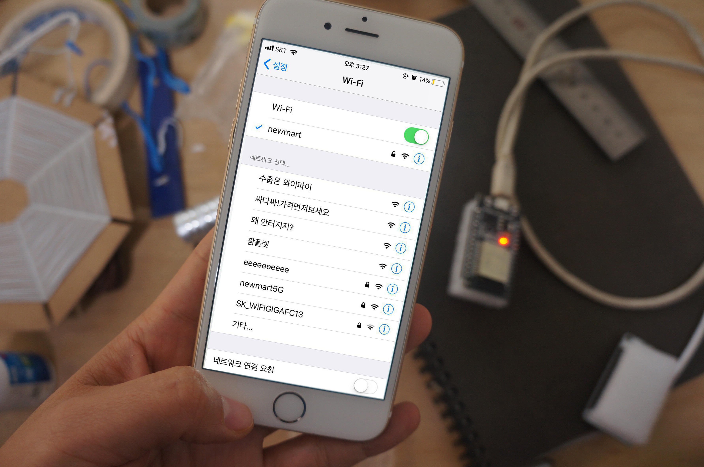{:width="500px"}](./assets/hotspot-zine-ssid.jpg)
[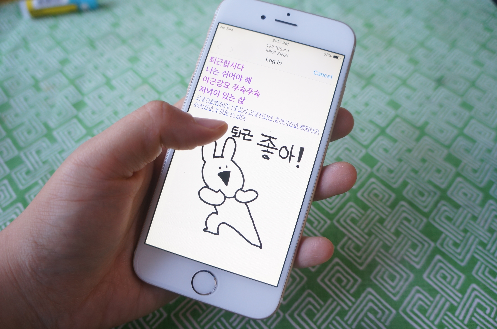{:width="500px"}](./assets/hotspot-zine-login.jpg)

- [View more](http://pilote.byus.net/wpdiana/?page_id=1064)

### Preceding project

- [CaptiveIntraweb by AReResearch (Andy Reischle) @ 2015](https://github.com/reischle/CaptiveIntraweb)

  [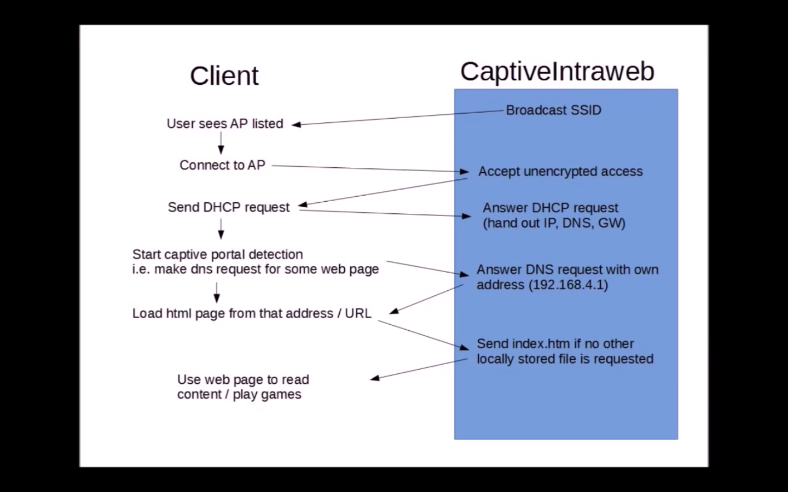{:width="500px"}](./assets/areresearch/img4.png)

### Components

- Tangible components
  - Espressif's ESP32 module
  - Power supply (battery or DC adapter)
  - (Optional) a case or a hull
  - (Optional) Magnets

  [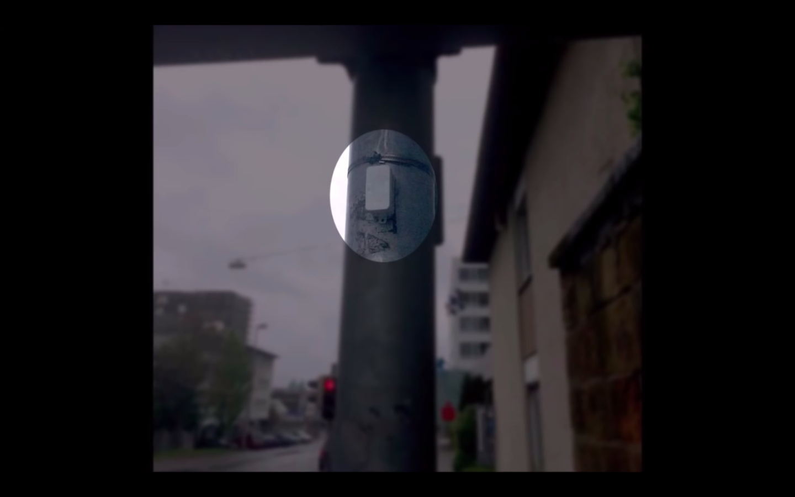{:width="500px"}](./assets/areresearch/img1.png)

  [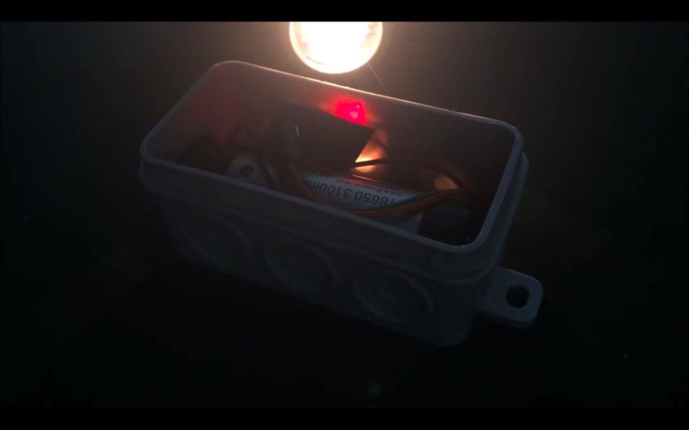{:width="500px"}](./assets/areresearch/img2.png)

  [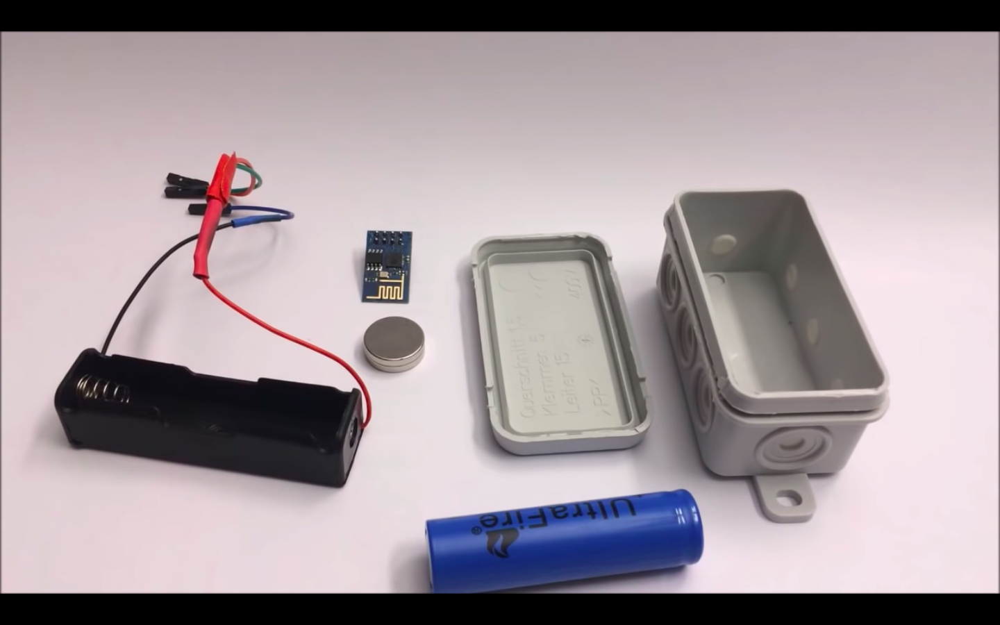{:width="500px"}](./assets/areresearch/img5.png)

  [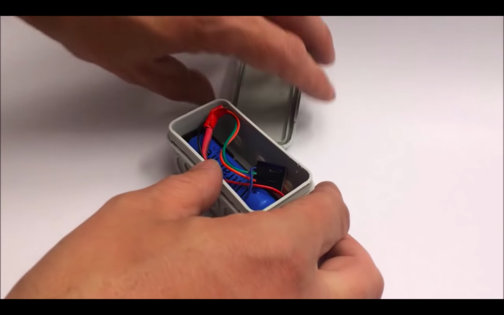{:width="500px"}](./assets/areresearch/img6.png)

  [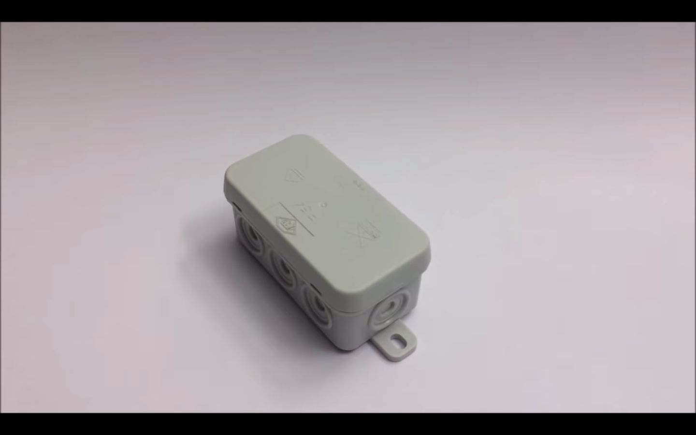{:width="500px"}](./assets/areresearch/img7.png)

  (These images are posted by Andy Reischle (AReResearch).)

- Intangible components
  - [ESP-IDF Development Environment](https://github.com/espressif/esp-idf/tree/master/components)
  - [ESP32 Arduino Compatibility Package](https://github.com/espressif/arduino-esp32)
  - [SPIFFS file system](https://github.com/espressif/arduino-esp32/tree/master/libraries/SPIFFS)
  - [ESP web server library](https://github.com/me-no-dev/ESPAsyncWebServer)
  - [A domain name server (captive portal)](https://github.com/espressif/arduino-esp32/tree/master/libraries/DNSServer)
  - Web page (Webzine)

  [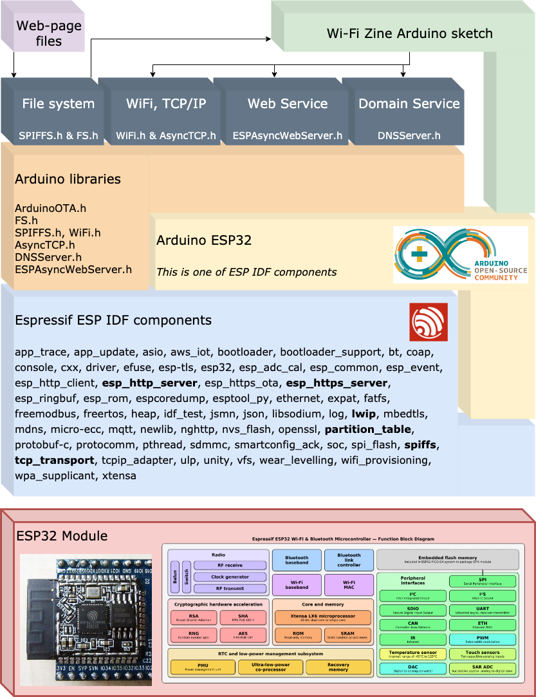{:width="500px"}](./assets/Wi-Fi-zine-stacks.png)

  - [More information](http://esp32.net/)
  - [The Wi-Fi stack is not open source](https://github.com/espressif/esp32-wifi-lib/issues/2)

### Limitations of Hot-spot zine platform that you should know

- Storage 2MB or less
- Slightly slower than a typical web server
- Somewhat unstable behavior compared to a typical web server (sometimes a system restart may be required)

## Making a Hot-spot zine

### Materials and preparations

- A computer
- A Development board with ESP32 module
- A Micro USB cable for communication (Android data cable)
- Battery, battery pack or DC adapter
- Web page (html / css / js + media files)
- (Optionally) a sensor or actuator (such as a speaker)

### Preparing Hot-spot zine platform

- [Arduino Download](https://www.arduino.cc/en/Main/Software)

- Installing Arduino

  - [Windows](https://www.arduino.cc/en/Guide/Windows)

  - [Mac OSX](https://www.arduino.cc/en/Guide/MacOSX)

    [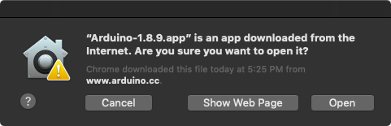{:width="300px"}](./assets/arduino-confirm.png)

    Click 'Open'.

  - [Linux](https://www.arduino.cc/en/Guide/Linux)

- Arduino IDE launch screen

  [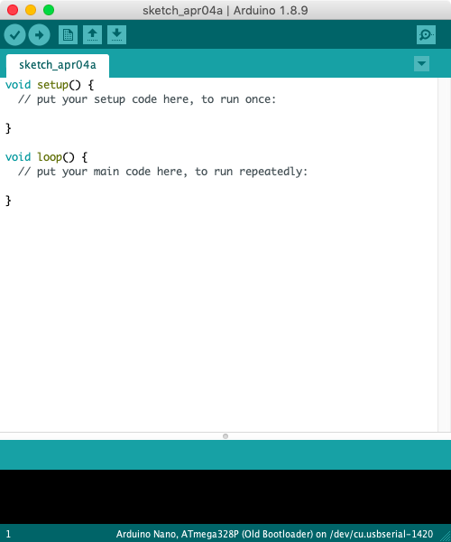{:width="300px"}](./assets/arduino-screen.png)

- Arduino IDE settings

  - Change the compilation and upload process display mode to 'verbose mode'

    [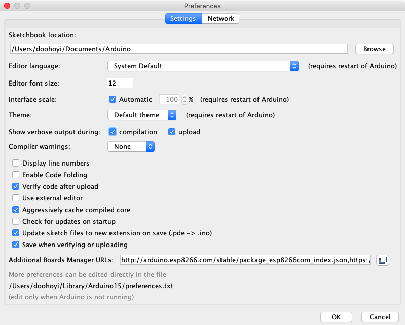{:width="300px"}](./assets/arduino-verbose.png)

    Check 'compile' and 'upload' in 'Show verbose output during:'

- [Adding an ESP32 boards to the Arduino IDE's board list](https://github.com/espressif/arduino-esp32/blob/master/docs/arduino-ide/boards_manager.md)

  - Copy and paste the following into 'Additional Boards Manager URLs' and click 'Ok'.

    ```
    https://dl.espressif.com/dl/package_esp32_index.json
    ```

    [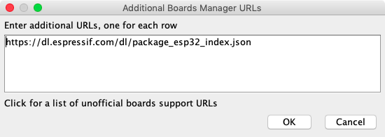{:width="300px"}](./assets/arduino-board-url.png)

  - Launch the Board Manager

    [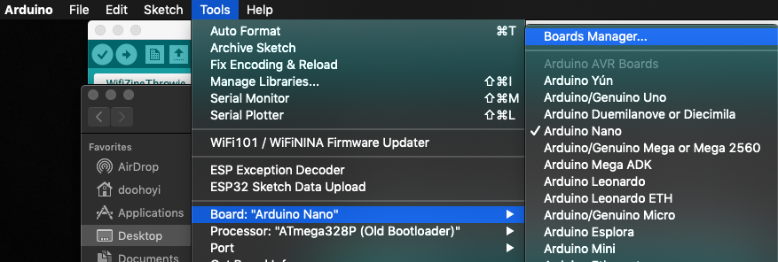{:width="300px"}](./assets/arduino-board-manager.png)

  - The Board Manager popup window

    [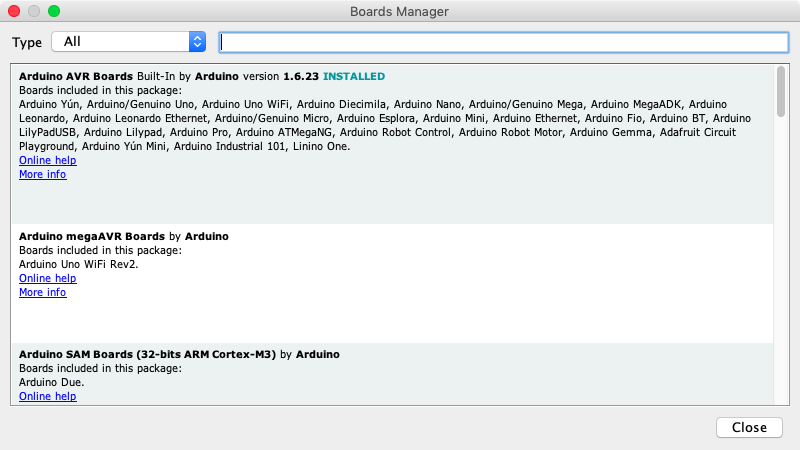{:width="300px"}](./assets/arduino-board-manager-popup.png)

  - Type 'esp32' in the search box and click 'Install'

    [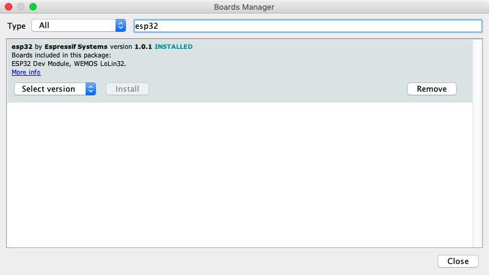{:width="300px"}](./assets/arduino-board-manager-esp32.png)

- Add Hop-spot zine platform code and required libraries to the Arduino IDE

  - [Hot-spot zine](https://github.com/applecargo/WifiZineThrowie/) download and installation

    Click 'Clone or download' -> 'Download ZIP'

    [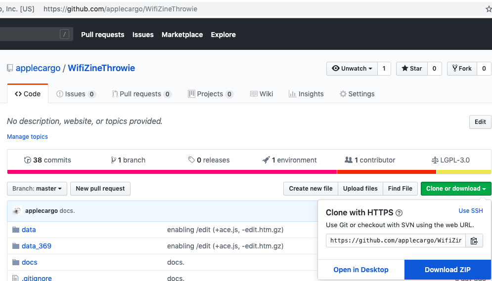{:width="300px"}](./assets/arduino-00010.png)

    Rename folder after decompression

    [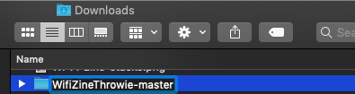{:width="300px"}](./assets/arduino-00011.png)
    [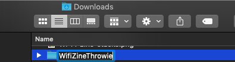{:width="300px"}](./assets/arduino-00012.png)

    Copy that folder to ~/Documents/Arduino ('~' means your home folders)

    [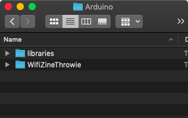{:width="300px"}](./assets/arduino-00013.png)

  - Downloading and installing the [ESPAsyncWebServer](https://github.com/me-no-dev/ESPAsyncWebServer) and [AsyncTCP](https://github.com/me-no-dev/AsyncTCP) libraries

    Click 'Clone or download' -> 'Download ZIP'

    [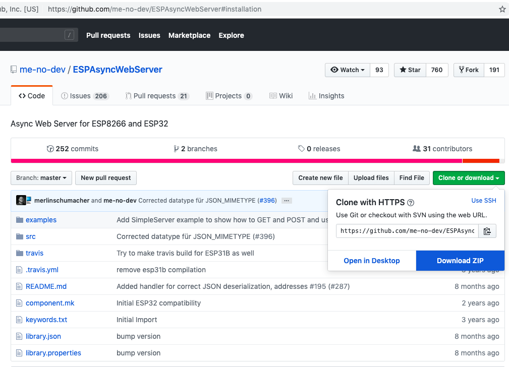{:width="300px"}](./assets/arduino-00001.png)

    Rename folder after decompression

    [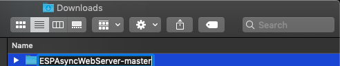{:width="300px"}](./assets/arduino-00003.png)
    [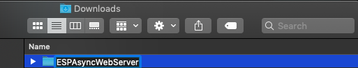{:width="300px"}](./assets/arduino-00004.png)

    Click 'Clone or download' -> 'Download ZIP'

    [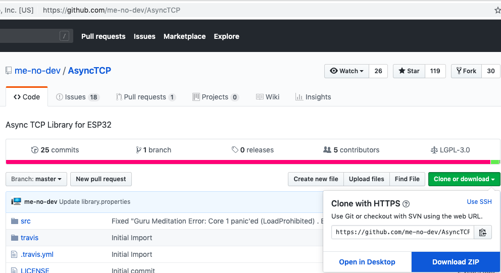{:width="300px"}](./assets/arduino-00006.png)

    Rename folder after decompression

    [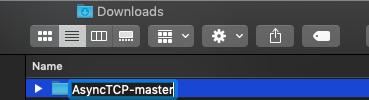{:width="300px"}](./assets/arduino-00007.png)
    [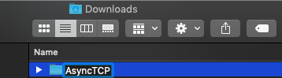{:width="300px"}](./assets/arduino-00008.png)

    Copy that 2 folders to ~/Documents/Arduino/libraries

    [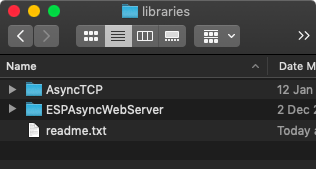{:width="300px"}](./assets/arduino-00009.png)

  - Confirming code compilation

    - Restart the Arduino IDE

    - Open 'WifiZineThrowie' sketch

      [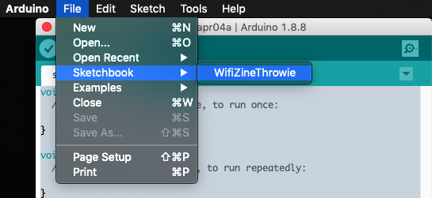{:width="300px"}](./assets/arduino-wifizine.png)

    - Select the ESP32 Dev Module board

      [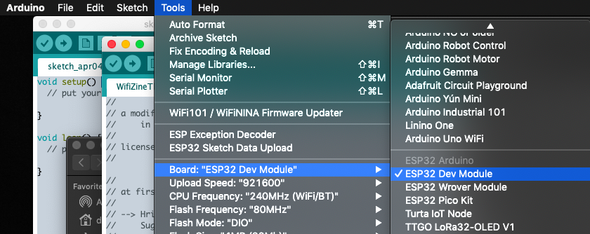{:width="300px"}](./assets/arduino-wifizine-select-board.png)

    - Adjust ESP32 Dev Module board settings

      [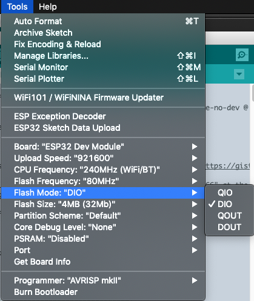{:width="300px"}](./assets/arduino-wifizine-config-board.png)

      - Upload Speed : 921600
      - CPU Frequency : 240MHz
      - Flash Frequency : 80MHz
      - Flash Mode : DIO
      - Flash Size : 4MB (32Mb)
      - Partition Scheme : Default
      - Core Debug Level : None
      - PSRAM : Disabled

    - Click on the compile button (red arrow)

      [{:width="300px"}](./assets/arduino-wifizine-popup.png)

    - If the compilation process is successful,

      [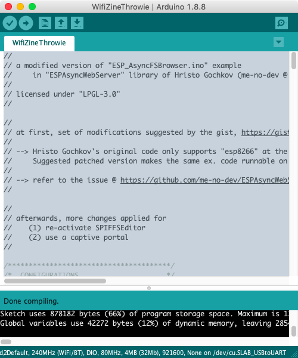{:width="300px"}](./assets/arduino-wifizine-compile-done.png)

    - If the compilation process ends abnormally,

      [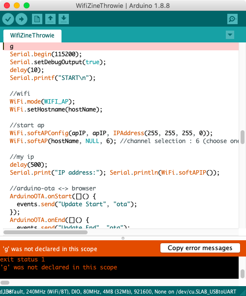{:width="300px"}](./assets/arduino-wifizine-compile-failed.png)

- Installing a USB device driver to communicate with the ESP32 module (chip name: SiliconLabs CP2012)

  - [USB communication chip driver download](https://www.silabs.com/products/development-tools/software/usb-to-uart-bridge-vcp-drivers)

    - [Windows 10](https://www.silabs.com/documents/public/software/CP210x_Universal_Windows_Driver.zip)
    - [Windows 7/8/8.1](https://www.silabs.com/documents/public/software/CP210x_Windows_Drivers.zip)

      - [Installation process](https://www.pololu.com/docs/0J7/all)

    - [Mac OSX](https://www.silabs.com/documents/public/software/Mac_OSX_VCP_Driver.zip)

      - [GateKeeper is a problem](https://support.apple.com/en-us/HT202491)

      - Yosemite (10.10.x)

        - [Legacy driver must be installed, instead normal one.](https://www.silabs.com/community/interface/forum.topic.html/latest_vcp_driverfo-96RK)

        [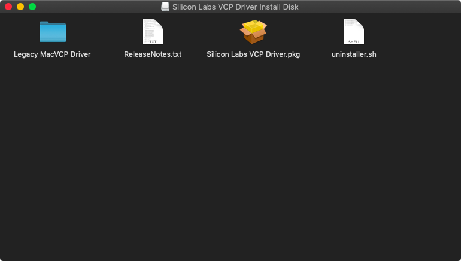{:width="300px"}](./assets/yosemite-cp2102.png)
        [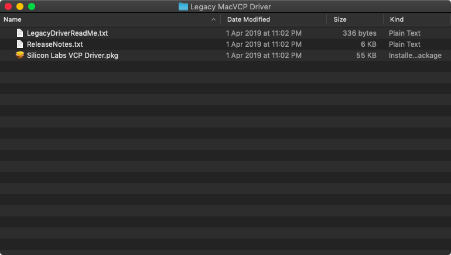{:width="300px"}](./assets/yosemite-cp2102-legacy.png)

      - El capitan (10.11.x)

        - [How to disable GateKeeper](https://medium.com/@krukmat/macos-el-capitan-enabling-usb-for-cp2102-usb-to-ttl-3b63449e02e9)
        - [csrutil enable --without kext](https://forums.developer.apple.com/thread/17452)

      - Sierra (10.12.x)

        - [How to disable GateKeeper](https://www.tekrevue.com/tip/gatekeeper-macos-sierra/)
        - sudo spctl --master-disable

      - High Sierra (10.13.x)

        - [How to disable GateKeeper](https://stackoverflow.com/questions/47109036/cp2102-device-is-not-listed-in-dev-on-macos-10-13)
        - [How to disable GateKeeper](https://pikeralpha.wordpress.com/2017/08/29/user-approved-kernel-extension-loading/)
        - [How to disable GateKeeper](https://www.silabs.com/community/interface/knowledge-base.entry.html/2018/03/30/usb_to_uart_bridgev-Dnef)
        - spctl kext-consent disable

      - Mojave (10.14.x)

        - [How to disable GateKeeper](http://osxdaily.com/2016/09/27/allow-apps-from-anywhere-macos-gatekeeper/)
        - sudo spctl --master-disable

    - Linux 3.x.x & 4.x.x

      - Driver installation not required (included in kernel)
      - [udev rules update required](https://docs.platformio.org/en/latest/faq.html#platformio-udev-rules)
      - [99-platformio-udev.rules](https://raw.githubusercontent.com/platformio/platformio-core/develop/scripts/99-platformio-udev.rules)

    - [Linux 2.6.x](https://www.silabs.com/documents/login/software/Linux_2.6.x_VCP_Driver_Source.zip)

      - No information

- Check if the USB driver is working

  - If you just installed the driver, restart your computer.

  - After restarting, make sure GateKeeper does not interfere with driver loading.

    - System Preferences -> Security & Privacy -> General

      [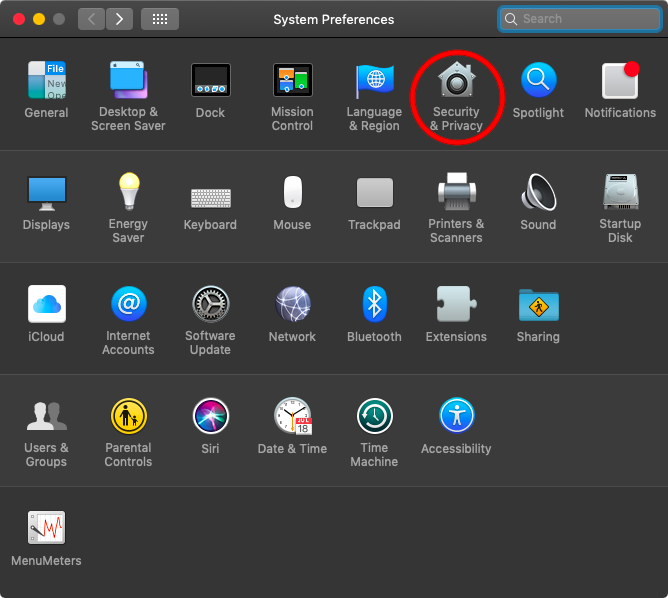{:width="300px"}](./assets/gatekeeper-check.png)
      [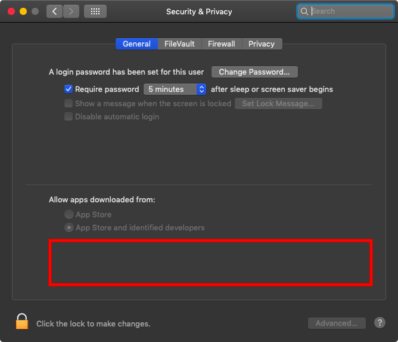{:width="300px"}](./assets/gatekeeper-check-popup.png)

      If there is an error message in the red box area, GateKeeper is interrupting the driver's operation.

      [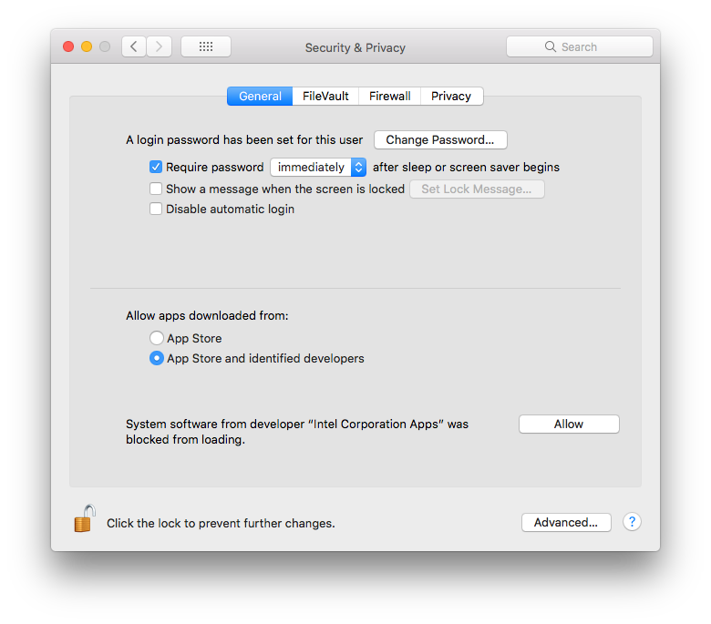{:width="300px"}](./assets/security_and_privacy_kextload_approval.png)

      If you are in a similar state as above, click 'Allow' and confirm with administrator password, then restart your computer.

  - After starting the Arduino IDE, make sure it can communicate with the ESP32 module

    [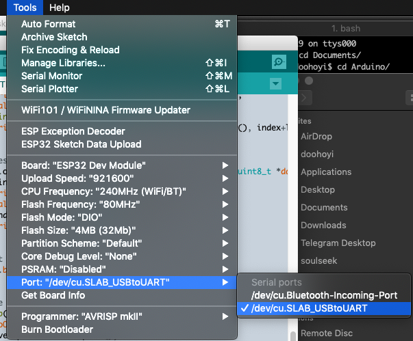{:width="300px"}](./assets/arduino-esp32-comm.png)

    If communication is possible, you can select /dev/cu.SLAB_USBtoUART (for other than Mac OSX, this name might be different.) as above.

    [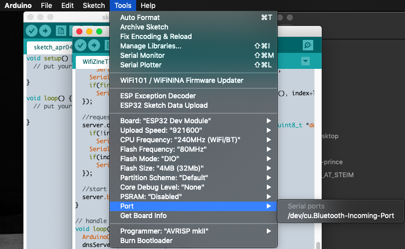{:width="300px"}](./assets/arduino-esp32-comm-failed.png)

    If communication is not possible, /dev/cu.SLAB_USBtoUART (for other than Mac OSX, this name might be different.) does not exist as above.

- Set the name of the Wi-Fi network i.e. SSID of the Hot-spot zine, and modify the code.

  [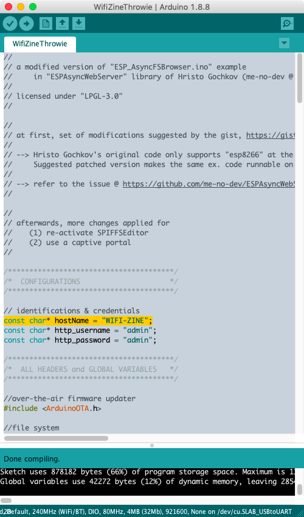{:width="300px"}](./assets/arduino-wifizine-ssid-change.png)

  - Since it may not work due to the number of characters or spacing, we try firstly with simple and short English names that does not include a space character.
  - Hangul(or any other non-English characters) may be used. (later, trial and error)

- Upload to the Board

  - Click on the Upload button (red arrow), while 'Connecting ...' displays, [press and hold the' BOOT 'button on the ESP board for one second](https://randomnerdtutorials.com/solved-failed-to-connect-to-esp32-timed-out-waiting-for-packet-header/).

    [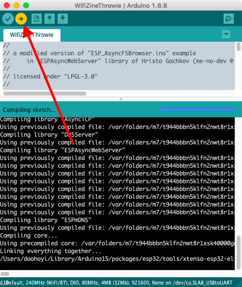{:width="300px"}](./assets/arduino-wifizine-upload.png)

    Upload success screen

    [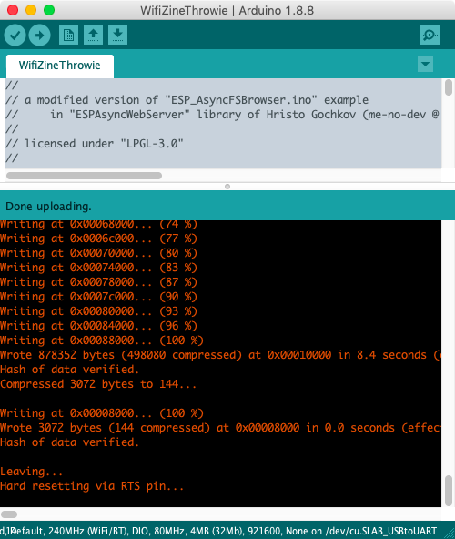{:width="300px"}](./assets/arduino-wifizine-upload-done.png)

    Upload error screen

    [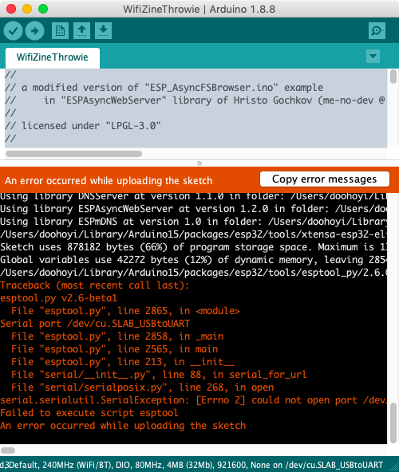{:width="300px"}](./assets/arduino-wifizine-upload-failed.png)

- [Various problem factors](https://randomnerdtutorials.com/esp32-troubleshooting-guide/)

### Increasing the upload capacity of the board (optional)

- The flash memory capacity of the provided ESP32 module is 4MB, but not all of this is usable for Zine content. The reason for this is that many other things also need their spaces: the codes that runs the hotspot-zine, the codes that runs background to support the chip function and the data used to represent the structure of the file system (such as folder structure and file distinction), that is, the implementation overhead of SPIFFS. So we cannot claim whole memory space of 4MB.

- The flash memory of the ESP32 module must be partitioned first to be used partly with different purposes.

- During the above procedure, when setting up the ESP32 board, we selected:

  [{:width="300px"}](./assets/arduino-wifizine-config-board.png)

  ```
  Partition Scheme : Default
  ```

  The default partition configuration includes elements that are not necessarily required for Hot-spot zine, and the default partition configuration does have less memory available for Zine content. (~ 1MB)

- So, by reconfiguring the Partition Scheme more efficiently, you may be able to upload a little more Hot-spot zine content. In this way, a capacity of about 1.9 MB can be achieved.

- Once you have completed this procedure, you may select,

  [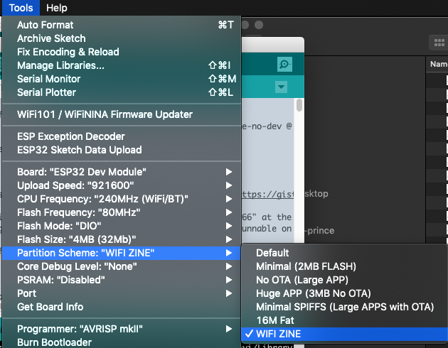{:width="300px"}](./assets/arduino-wifizine-custom-partition.png)

  ```
  Partition Scheme : WIFI ZINE
  ```

- Work process

  - Download and install [the partition configuration file](https://raw.githubusercontent.com/applecargo/WifiZineThrowie/master/partition/wifi_zine.csv)

    Paste it into ~/Library/Arduino15/packages/esp32/hardware/esp32/1.0.1/tools/partitions

    [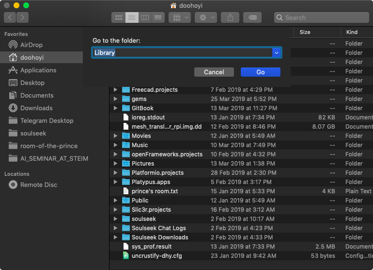{:width="300px"}](./assets/arduino-partition-00001.png)

    The '~/Library/' folder is a hidden folder in the Finder, so type Cmd-Shift-G and type in 'Library'

    [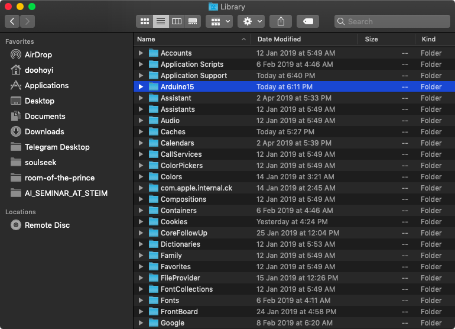{:width="300px"}](./assets/arduino-partition-00002.png)

    Then, double-click the 'Arduino15' folder as a normal folder

    [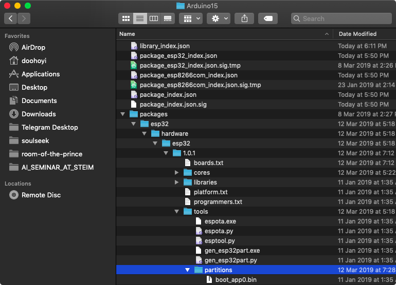{:width="300px"}](./assets/arduino-partition-00003.png)

    Move to the above position

    [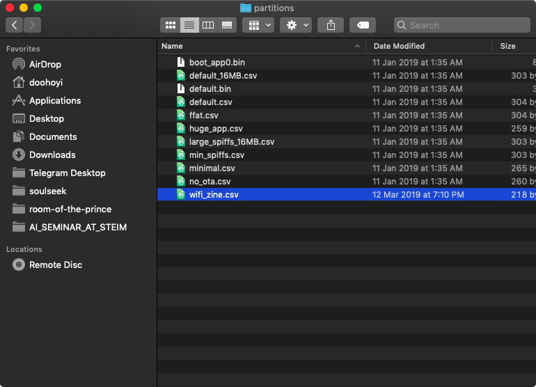{:width="300px"}](./assets/arduino-partition-00004.png)

    Make it like this.

  - Edit the boards.txt file

    [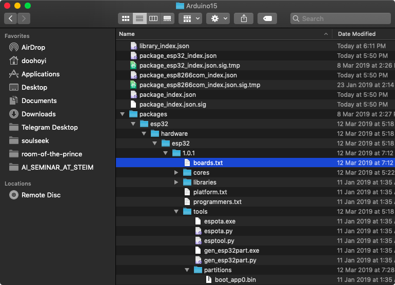{:width="300px"}](./assets/arduino-partition-00005.png)

    Open the file boards.txt file located in the above location and add the next four lines marked with + (remove the + sign!)

    ```diff
    --- /Users/doohoyi/Downloads/Telegram Desktop/boards.txt
    +++ /Users/doohoyi/Library/Arduino15/packages/esp32/hardware/esp32/1.0.1/boards.txt
    @@ -52,6 +52,10 @@
     esp32.menu.PartitionScheme.min_spiffs.upload.maximum_size=1966080
     esp32.menu.PartitionScheme.fatflash=16M Fat
     esp32.menu.PartitionScheme.fatflash.build.partitions=ffat
    +esp32.menu.PartitionScheme.wifi_zine=WIFI ZINE
    +esp32.menu.PartitionScheme.wifi_zine.build.partitions=wifi_zine
    +esp32.menu.PartitionScheme.wifi_zine.upload.maximum_size=1048576
    +esp32.menu.PartitionScheme.wifi_zine.upload.maximum_data_size=2752512

     esp32.menu.CPUFreq.240=240MHz (WiFi/BT)
     esp32.menu.CPUFreq.240.build.f_cpu=240000000L
    ```

  - After restarting the Arduino IDE, select PartitionScheme as 'WIFI ZINE' during ESP32 DEV Module setup and compile.

### Uploading and publishing Hot-spot zine content

- Hot-spot zine content is stored separately from the running code. Therefore, it goes through a separate process from the usual Arduino IDE code upload process. To do this, you need to install a separate extension plug-in.

- Download and install [the ESP32FS plug-in](https://github.com/me-no-dev/arduino-esp32fs-plugin/releases)

  Create a folder called '~/Documents/Arduino/tools'

  [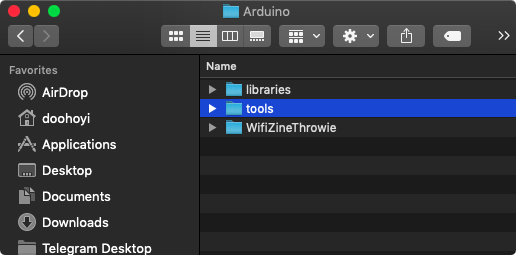{:width="300px"}](./assets/arduino-esp32fs-00002.png)

  Copy unpacked ESP32FS to here

  [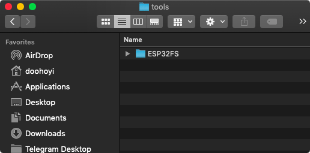{:width="300px"}](./assets/arduino-esp32fs-00003.png)

  Be mindful with the construction of the folders. It should be installed as shown in the following figure. (Note also that the folder name is ESP32FS!)

  [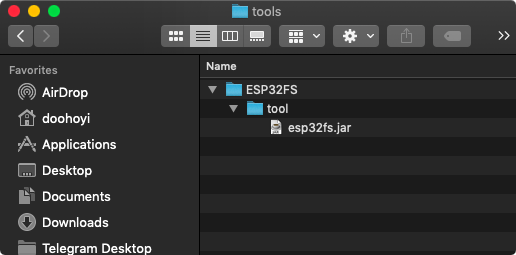{:width="300px"}](./assets/arduino-esp32fs-00004.png)

  After restarting the Arduino IDE, verify that the plug-in installation was successful. If successful, you will see a menu called 'ESP32 Sketch Data Upload' added.

  [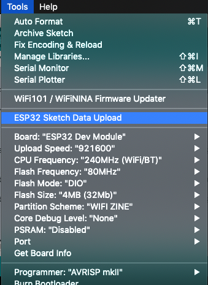{:width="300px"}](./assets/arduino-esp32fs-00005.png)

  When you run this menu, it will move all the files in the '~/Documents/Arduino/WifiZineThrowie/data' folder to the ESP32 module's web page store.

  [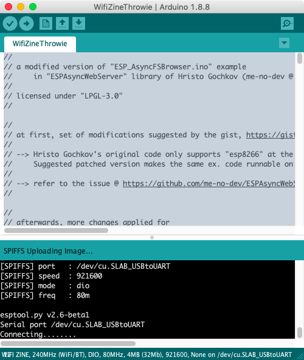{:width="300px"}](./assets/arduino-wifizine-webpage-upload.png)

  Please execute the upload. The color of the message output during upload is displayed in white instead of red.  While 'Connecting ...' displays, [press and hold the' BOOT 'button on the ESP board for one second](https://randomnerdtutorials.com/solved-failed-to-connect-to-esp32-timed-out-waiting-for-packet-header/).

  Screen when upload is completed successfully

  [{:width="300px"}](./assets/arduino-wifizine-webpage-upload-done.png)

  Congratulations. We are all ready to produce / publish Hot-spot zine.

## Generic content example of Hot-spot zines

- Example 1 Text page

  - [Hello, Text?](https://github.com/applecargo/WifiZineThrowie/blob/master/data-text.zip?raw=true)

    - [Obtaining fonts](https://www.dafont.com/)

- Example 2 Images page

  - [Imaginary, world](https://github.com/applecargo/WifiZineThrowie/blob/master/data-image.zip?raw=true)

- Example 3 Sounding page

  - [Sound-world!](https://github.com/applecargo/WifiZineThrowie/blob/master/data-sound.zip?raw=true)

- Example 4 Hyper-linked pages

  - Looooong story! (TBD)

- 예시 5

  - (advanced) WebSocket - socket.io + server-side programming @ arduino (TBD)

    - I have not tried it, but it must be possible. Let's create an example.

## Play with shapes and materials

- Attaching a sensor

  - switch? G-sensor?

- Attaching something that moves/acts

  - motor? speaker?

## Thinking with locations / places

- Attaching to the steel structure of the street or space using magnets

## Contributing to the project

- By sharing ZINE content, you can share ideas and inspirations for others who are creating Hot-spot zines. It is better to tell us your background story, context, form and so on.
- If you have ideas on how to improve the various parts of the Hot-spot zine program, please send us a revision with PR.
- If you have any other thoughts or opinions, please email me. <mailto:pilotedeguerre@gmail.com>

## Thank you!


# H&D Walking signal / WIFI hotspot zine workshop.

## Technical guides.

### What is a hot-spot zine?

- A standalone WIFI signal broadcaster
- A standalone captive portal webserver which serves a webpage instead of regular login page
- This webpage plus this electronic device itself is a zine platform
- A standalone networking device which can be used to communicate with others
- A network that ‘you’ have the complete (relatively) control over it (than.. for instance, the Internet)
- A ‘walking’ network or a signal that you can carry/accompany with your physical presence
- [more info](http://pilote.byus.net/wpdiana/?page_id=1064)
- Consist of… : ESP32 module + powering device + your content + your ‘context’

### How to make one?

#### What is needed.

- A computer
- A ESP32 breakout board
- microUSB cable (so called, android data cable)
- A battery or powerbank
- A webpage (html/css/js + media files)
- (optional) Magnets : you attach or install the module at some specific place / location, to give more context/happening
- (optional) A case / a hull : you shape/materialize it to give it more context/happening.
- (optional) Sensory peripherals or actuators (incl. speakers etc) : to give it more context/happening.
- (optional) A concept / a idea

#### Limitations

- Storage 2MB (or less)
- A bit slower than normal web servers
- Maybe a bit unstable from time to time : you can re-start the module whenever needed.

#### How to upload your code to the device

- Installing USB driver which enables us to communicate to the chip (i.e. the module: ESP32)
  - For Windows users
    - Windows 7
    - Windows 8
    - Windows 10
  - For Mac OSX users
    - Yosemite (10.10)
    - El capitan (10.11)
    - Sierra (10.12)
    - High Sierra (10.13)
    - Mojave (10.14)
  - For Linux
    - Debian derived
    - Archlinux derived

  - Testing USB communication
    - Enabling verbose/detailed output of the procedure that arduino takes for compilation and uploading steps
    - Try compile & upload and see if it works with the simplest example: Blink example
    - How to listen to the device with Serial comm. Example

  - Preparing hotspot-zine code and installing additional components that is needed by the code (libraries)
    - How to use arduino’s Library Manager to install a new library
    - What we need to install
      - ESP32AsyncWebServer
      - AsyncTCP
      - …
    - Where is the code?
      - USB drive
      - Or github, using git.
  - Choose your SSID and modify the default one
  - Try compile & upload and see what happens.

#### Uploading the zine content

- Installing additional tools for extending arduino functionality to support ESP data uploading (for the website data)
- Let’s try again the most simplest one: ‘Hello, world!’ example page

#### Working with your zine contents

- Template #1 : Text-oriented single page: ‘Hello, world!’
- Template #2 : Image-oriented single page: ‘Imaginary, world.’
- Template #3 : Sound-oriented single page: ‘Sound world!’
- Template #4 : Multiple-pages: ‘Looooong story!’
- Template #5 : Paper.js
- Template #6 : P5.js
- Template #7 : <http://molleindustria.github.io/p5.play/>
- Template #8 : Tone.js
- Template #9 (advanced) : WebSocket - socket.io + server-side programming @ arduino

#### Working with the shape and materialization

- Adding sensors : example (buttons)
- Adding actuators : example (motor)

#### Working with the location

- Magnets and installing at public space

### Contribution to the project

- Sharing your zine content & construction + your concept/context
- Approvements on the wifi-zine code: send PR @ github
  - And plz be patient, i have never used PR system.. Need to learn :)
- Or simply e-mail your idea and stuff : <mailto:pilotedeguerre@gmail.com>

### Thank you!
